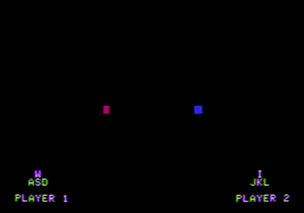

|   |   |
|---|---|
| | |
| | |

These are games I wrote for an Apple II computer, which looks like this:

All of them except "guess-the-number" started out as Applesoft BASIC programs, and got re-written in C. They probably aren't that exciting unless you have a physical Apple II, but you can still try them out in an [emulator](https://www.scullinsteel.com/apple/e).
